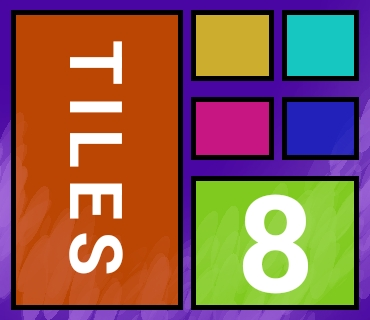

# TilesEight (a.k.a. Tiles8)

  

## Overview

TilesEight is an Android home launcher inspired by Windows Phone and Windows 8 design. It transforms Android home screens into a tile-based launcher experience with wallpaper support, search, custom tile sizes, and a launcher-style app grid.

## Key Features

- Windows Phone / Windows 8-style tile launcher experience
- Uses the device wallpaper as launcher background
- Search bar for filtering apps
- Customizable tile size for portrait and landscape
- Toggle app tile icon and tile labels on/off
- Orientation-aware layout with portrait and landscape support
- Optional scroll bars for portrait and landscape modes
- Prompt to set TilesEight as the default home launcher
- App launch animation with Windows-style visual effect
- About dialog with GitHub link

## Settings

TilesEight includes a settings screen where users can configure:

- Show or hide tile names
- Show or hide tile icons
- Enable or disable search bar shadow
- Enable tile icon caching
- Show Start-style text in landscape and portrait separately
- Adjust tile size values for portrait and landscape
- Enable vertical or horizontal scroll bars

## Requirements

- Android SDK: compileSdkVersion 33
- minSdkVersion 21
- targetSdkVersion 26
- Java / Android Studio compatible with Android Gradle Plugin

## Build & Run

### NOTE: This project was created and compiled on a legacy Android IDE, AIDE, which it uses the Eclipse ADT format. So, at the welcome screen in Android Studio, look at the top-right three dots, and click Import Project (Eclipse ADT, Gradle, etc), and then you may now proceed to import this project.

## Project Structure

- `app/src/main/AndroidManifest.xml` — app permissions and launcher intent
- `app/src/main/java/com/jarrredapps/win8remastered/` — launcher source code
- `app/src/main/res/layout/` — UI layouts for main activity, tiles, settings, and dialogs
- `app/src/main/res/xml/preferences.xml` — launcher preferences
- `app/build.gradle` — Android module configuration

## Notes

- The launcher checks whether TilesEight is set as the default home app and prompts the user if not.
- The app loads installed launcher apps dynamically and excludes itself from the tile grid.
- The tile size dialog stores separate values for portrait and landscape modes.

## License

This project is licensed under the GNU General Public License v3.0. See `LICENSE.md` for details.

## Contact

Created by Jarred. For more information or to star the project, visit the GitHub repository. If you want a feature request or report a bug, email reyesgavinjarred@gmail.com
