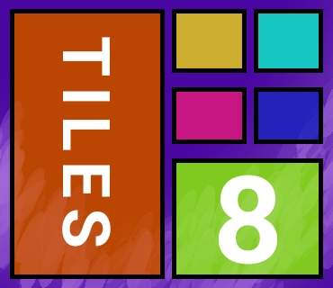

# TilesEight (a.k.a. Tiles8)

  

## Overview

TilesEight is an Android home launcher inspired by Windows Phone and Windows 8 design. It transforms Android home screens into a tile-based launcher experience with wallpaper support, search, custom tile sizes, and a launcher-style app grid.

## Key Features

- Windows Phone / Windows 8-style tile launcher experience
- Uses the device wallpaper as launcher background
- Search bar for filtering apps
- Customizable tile size for portrait and landscape
- Toggle app tile icon and tile labels on/off
- Orientation-aware layout with portrait and landscape support
- Optional scroll bars for portrait and landscape modes
- Prompt to set TilesEight as the default home launcher
- App launch animation with Windows-style visual effect
- About dialog with GitHub link

For Screenshots, [click here](screenshots.md)

## Settings

TilesEight includes a settings screen where users can configure:

- Show or hide tile names
- Show or hide tile icons
- Enable or disable search bar shadow
- Enable tile icon caching
- Show Start-style text in landscape and portrait separately
- Adjust tile size values for portrait and landscape
- Enable vertical or horizontal scroll bars

## Requirements

- Android SDK: compileSdkVersion 36
- minSdkVersion 23
- targetSdkVersion 36
- Java / Android Studio compatible with Android Gradle Plugin

## Installation

- Download the latest apk at the Releases tab
- Install the apk and make sure you to bypass the Play Protect harmful app detection.
- Do not launch the app yet, unless you enable \"**All Files Access**\" (MANAGE_EXTERNAL_STORAGE) for TilesEight.
- After enabling, you may start the launcher.
- Next, make the TilesEight as a default home launcher.
- Then, enjoy your Windows Phone simulator. hehe...

## Warning
As I remember that some other phones,
it might be making your phone useless or 
having issues when setting TilesEight as a default launcher.

If you have issues, contact reyesgavinjarred@gmail.com or in the Github Issues.

## Project Structure

- `app/src/main/AndroidManifest.xml` — app permissions and launcher intent
- `app/src/main/java/com/jarrredapps/win8remastered/` — launcher source code
- `app/src/main/res/layout/` — UI layouts for main activity, tiles, settings, and dialogs
- `app/src/main/res/xml/preferences.xml` — launcher preferences
- `app/build.gradle` — Android module configuration

## Notes

- The launcher checks whether TilesEight is set as the default home app and prompts the user if not.
- The app loads installed launcher apps dynamically and excludes itself from the tile grid.
- The tile size dialog stores separate values for portrait and landscape modes.

[Click here to show spoilers!](spoilers.md)

## License
This project is licensed under the GNU General Public License v3.0. See `LICENSE.md` for details.
